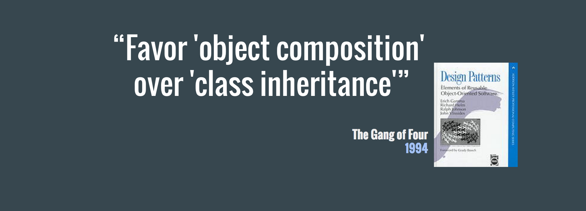

# The magical quest for Componentisation

Several months ago I gave a talk at one of our fortnightly **Unruly Tech Talks** about a topic that I had been mulling around in my head for several months prior.
Triggered by my adoption of the library, I found the topic of React as an abstraction of software architecture to be highly intriguing.

But we'll get to *React* in a moment. First I'd like to ask you an existential question.

**What is the core of our job as developers today?**

It probably **isn't** *figuring out the next super cool & complex algorithm.*

But rather, what our job probably **is**, is to *take an existing abstraction and compose it with a second abstraction in order to form a third abstraction*.

What we're still trying to figure out is how best to do that, right? For me, that quest began with modularisation. 

## Modularisation
Until I began using *React* a couple of years ago, I spent several years evangelising *Backbone* as a solution to the problems my clients and employers had been facing when tackling their Front End architectures. As a relatively early adopter of Backbone, in early 2011, I found the move from a messy soup of global Javascript objects with complex prototypical hierarchies, to a structured MVC (or rather, MVP) pattern an extremely pleasing step forward.

Backbone allowed us to focus less one how the pieces of our code fit together, and more on what they actually did. This was made possible by abstracting away a lot of the boilerplate and defining a clear API for each piece of our system.
This might seem obvious in hindsight, but at the time this felt groundbreaking, mostly because we were so used to our Javascript existing as *a pile of code held together by duct tape* that we accepted our fate and found it hard to see the potential for a better option.

But the key *unique selling point* of Backbone, beyond removing boilerplate and an enforced API, was the fact that it lay the groundwork for proper **modularisation** of our Javascript codebases.

Modules are a corner stone of good code structuring, as they encourage us to break our code down into individual logical pieces. This makes it easier for us to write maintainable code that's easier to reason about, to test and to reuse.

## Rachel's Trifle
Backbone, though, as it turned out, was not the be-all and end-all solution to our problems.

We could definitely leverage the benefits of MVC to achieve several things, such as breaking down our architecture into multitiered Object Oriented designs, to strive for separation of concerns by layering our modules and to design inheritance chains meant to improve code reuse and reduce complexity. But it seemed we would always end up hitting the same inevitable wall.

As a codebase would grow, requirements would changed and assumptions turned out to be incorrect, we often found that our abstractions began to fail us.

What we would initially envision as a well thought out and layered Trifle, turned out to be more a mixed up recipe, where layers don't quite make sense anymore, they end up seeping into the layers above and bellow them and something just doesn't taste quite right anymore. This in turn makes it harder to reuse code, to test it and to maintain it.


*Rachel's Trifle? Good. **Code Trifle**? Bad.*

In other words, our code would develop a smell... the unmistakable smell of a Custard, Jam, Mashed Potatoes and Meat dessert.

## Wait, but why?
Einstein never actually said that *insanity is doing the same thing over and over again and expecting different results*, but I'd like to think that he *would* agree that when we find ourselves repeating a mistake, we should probably rethink our initial approach.

I tried to identify the root causes for why so many of the teams I'd worked on ended up with these code smells and I narrowed them down to the following four:

**Building complex and / or distributed state machines**
We often try to manage state in many different places and try to reconcile this state throughout the lifecycle of the application. This is hard to do well, and leads to many implicit assumptions which easily break.

**Big bags of instruction rather than atomic declarative pipes**
Instructions may be easy to follow, but not always easy to understand. They usually describe *what* is done, rather than *why* and *how*. This means that the developers are left to figure out the *why* themselves. We've all found ourselves doing this, often referring to it as *reverse engineering our own code* and we often end up misinterpreting the *why*.

**Complex dependency chains reducing our ability to make atomic pieces of code**
We often find it hard to make truly atomic pieces of code as they have an inherent *need* for a piece of data or operation that is the concern of another piece of the code. This dependency will always exist in a complex system, but in the absence of a clear API for bridging these dependencies without creating a cohesive coupling between the two pieces, this can lead to dependency chains which are hard to reconcile.

**Trying to predict the future**
By far the biggest culprit for the dank code smell is a habit developers have of trying to predict how their code will be used instead of focusing on what is needed. This can lead to many problematic implementations, but most of all it leads to over engineering of solutions, which often leads to code that is very hard to *delete* later.
I'm a firm believer that good code should be easy to delete and over engineering often makes that much harder to do.

### Searching for answers
Having boiled down my problem to its root causes, the next step would be to figure out what I could do to reduce their impact on how I write my code.
When looking at the aforementioned points, I believed they could be reduced to one core issue, which is that my code would often end up with **High Efferent Coupling & Fragmented State**.

Which begged the question:
***How on earth do we reduce our efferent coupling & fragmented State?***

Searching high and low for an answer I hit the internet, the books, the tech talks, my dad (I didn't literally hit my dad, I just asked his opinion, as he's been writing code since the 70s, presumably with hippie hair and a spliff) and found that there are infact many possible answers to this question.

I won't enumerate all of them, but one answer would show up repeatedly, and that was a quote which I'd heard many times before:



> **Side note:** *Note the year in which this book, considered a religious tome by many developers, was released. 1994. That's 22 years ago, that's it. If anything serves to remind us that we're still "just figuring out this shit, because it's bloody new", it's that.*

In fact, this quote has been repeated so many times by so many people, I've began to find it *eye-roll inducing*.

The reason I found this quote slightly annoying was that the more I discussed this topic with experienced developers, the more it would reminde me of another quote.


While it seemed many developers appreciated the wisdom in this advice, reflected in the fact that it has been featured in innumerable talks and blog posts, very few could actually show me *how to achieve this*.

*Composability* is not an inherently clear idea, and while many developers seems perfectly capable of coding up an example in an IDE, they never seemed to actually follow through when it came to their codebase. And most annoying, they knew it, but couldn't quite translate this theory into practicality once they had real problems they needed to solve.

### What is Composition?
So to figure out how to achieve *composability*, we first need to understand what *composition* actually means.

To the best of my understanding there are two kinds of composition.

The first is **functional composition**. I'll assume for the sake of succinctness, that you already know what functional composition is, as this blog post is already way too long.

But just to make sure we're on the same page I'll clarify that when I say functional composition, what I mean is that, in the following snippet, the **h** function is the *functional composition* of the **g** and **f** functions.
```javascript
const g = () => {}
const f = () => {}

// (g ∘ f )(x) = g(f(x))
const h = (...args) => g(f(...args))
```

The second kind of composition is **object composition**, and this is where I got stuck.

I just couldn't wrap my brain around how I was supposed to take the theory of Functional Composition and apply it to complex objects. How to structure the pieces of my code and make them work together without relegating back to old and smelly practices.

#### What is Object Composition?
[Eric Elliot](https://twitter.com/_ericelliott) gave a really good talk at [Fluent 2013](https://www.youtube.com/watch?v=lKCCZTUx0sI) in which he explains object composition and its benefits in a much better way than I ever could, so I'd highly recommend watching his talk.

But after experimenting with Eric's proposed solution, a library called [StampIt](https://github.com/stampit-org/stampit), I still couldn't see how I could avoid the high Efferent Coupling I was experiencing, nor did it do much to help me tackle the fragmented state.

This feeling of frustration with the smell of my code would stay with me for a while, until recently, when I began using *React* in production. It wasn't immediately apparent to me how React seemed to alleviate many of the problems I was experiencing, nor do I want to tote React as necceserily a *solution* to these problems.

What I have found *React* to be though, is an opportunity to alleviate many of the causes for these code smells, and that's the actual topic I want to talk about.

## Composability via Componentisation
I often hear developers talk about the difference between the *react* package and the *react-dom* package. They seem to always focus on how the separation provides the ability to use *React*'s top level API to define *loosely coupled* components for different Renderers and Reconciler in order to share components and logic between different target technologies. They will also discuss how the uniderectional flow of data aids in avoiding *fragmented state*. Sadly, though, it's much more unusual though to hear them  discuss what it is about the top level API that makes it so well suited for building such a wide variety of components with relatively low efferent coupling.

React is often toted around as highly declarative, composable and encapsulated. In fact, these descriptions are stated on the React homepage, but no where in the documentation is it discussed what it is about React's API that allows for these traits. These traits are simply stated as fact.

I guess the rest of the Javascript community is much more practical than I am, because I found myself much more concerned with *why* it worked than anyone else I talked to.

### From Function to Component
Analysing React, what I realised was that a direct parallel can be made between the API of Functional Composition and the React API. 

Lets break down the API of Functional Composition and label the different building blocks:
```javascript
// We'll label g() and f() as the `parent` and `child` functions
const parent = () => {}
const child = () => {}

// we'll label the arguments for the composition as `props`
const props = [x, y, z]
// we'll add a little flexability by allowing the parent and child
// to have their own arguments, and leaving it up to the parent to decide
// what to do with the child
const childProps = [a, b, c]

const composition = (props) => parent(props, child(childProps))
```

While this might not be immediately apparent, the above composition is actually reminiscent of *React*'s top level API. In order to see it though, we'll have fade away some of the layers of abstraction provided by JSX.

If you look at the React docs you'll find an [article explaining JSX's compilation target](https://facebook.github.io/react/docs/jsx-in-depth.html).
Specifically what might interest you is how the following JSX:
```javascript
<MyButton color="blue" shadowSize={2}>
  <Echo value="Click Me" />
</MyButton>
```
compiles to:
```javascript
React.createElement(
  MyButton,
  {color: 'blue', shadowSize: 2},
  React.createElement(
    Echo,
    {value: 'Click Me'}
  )
)
```

While it might not be apparent at first glance, this API could easily be a wrapper for the functional composition we built a couple of snippets ago.

Lets replace the React Component references and props with the labels we defined in our snippet.
```javascript
React.createElement(
  parent,
  props,
  React.createElement(
    child,
    childProps
  )
)
```

This might seem obvious in hindsight, but by adding a little abstraction and expanding flexibility by allowing the parent functions to have their own arguments in addition to the return values of the child functions, React has actually provided us with a highly flexible API for Object Composition.
By defining a strict API for the communication between all pieces of your code, you achieve an ideal situation where:
1. Every piece of your code knows how to talk to every other piece
2. Every piece of your code can be passed as an argument to any other piece

I tried asking a couple of members of the React core team what they would call this design pattern, but sadly never got an answer. Considering how swamped they must be with issues, emails and life, I decided not to pursue them further and simply named this design pattern thus: **Componentisation**.

### The rules of Componentisation
Considering the componentisation API as a generic design pattern I defined a set of 7 rules which any library must follow in order to provide the composability I strive for:
1. Every composed object must be either a Component or at most a built in type
2. There is one parent object
3. There can be multiple child objects
4. A parent object can receive its own arguments (rather than being limitted to receiving the return value of child objects)
5. child objects can receive their own arguments
6. A parent object can interact with a single child independantly and with all children as a group
7. A component doesn’t have to “know” its children in order to interact with them

I believe that any library that follows these rules could, in theory, provide the high level of composability required to build complex systems without compromising on low cohesiveness and efferent coupling.

### Learning more
Following the React core team on Twitter and Github provided true insight into how this API is transforming the way developers are writing code since the library was introduced.

For example, the following thread by Sebastian Markbåge caused my brain to turn inside out at one point.

<blockquote class="twitter-tweet" data-lang="en"><p lang="en" dir="ltr">I refer to the number of components in your application layer, component layer, layout layer, rendering layer as: Horizontal surface area.</p>&mdash; Sebastian Markbåge (@sebmarkbage) <a href="https://twitter.com/sebmarkbage/status/704737113007259648">March 1, 2016</a></blockquote>
<blockquote class="twitter-tweet" data-lang="en"><p lang="en" dir="ltr">The number of layers for a feature is: Vertical surface area. React can expand to include more verticals without growing horizontally.</p>&mdash; Sebastian Markbåge (@sebmarkbage) <a href="https://twitter.com/sebmarkbage/status/704737495448055808">March 1, 2016</a></blockquote>
<blockquote class="twitter-tweet" data-lang="en"><p lang="en" dir="ltr">This is what will keep React from becoming a huge monolith yet get synergy effects from vertical integration. <a href="https://t.co/oukDDLw7a6">https://t.co/oukDDLw7a6</a></p>&mdash; Sebastian Markbåge (@sebmarkbage) <a href="https://twitter.com/sebmarkbage/status/704738517641920512">March 1, 2016</a></blockquote>

I would highly recommend following them and reading the issues on the GitHub repo. I've learned alot from doing just that and I'm sure you will too.